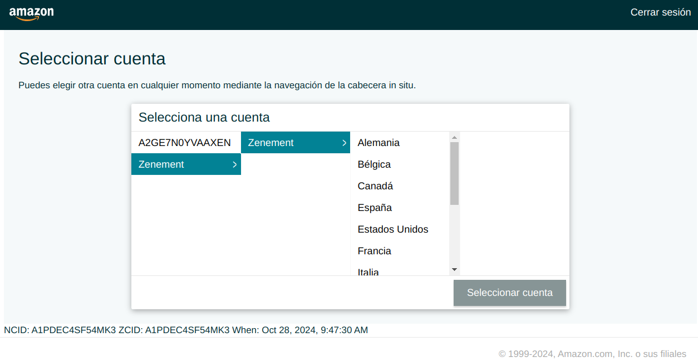
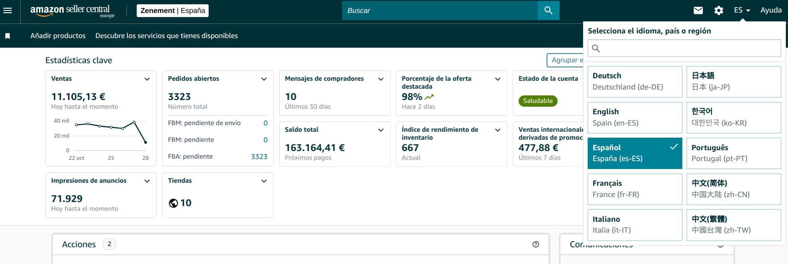

# SellerCentralReviewScrapper
The porpose of this project is to gather Zenement product reviews, and upload them to the Google Big Query data warehouse.

The scrapper needs user interaction to log in and navigate the Amazon Seller Central Backoffice.

## Dependency installation
There are four non-native python packages required: `beautifulsoup4, google-cloud-bigquery, selenium, webdriver-manager`. 

You can quickly install them on your system's python with the command:
```sh
pip install -r requirements.txt
```

Alternatively, if you care to install the dependencies on a virtual environment, follow these steps:

```sh
python -m venv venv

# Activate the virtual environment
# On macOS/Linux:
source venv/bin/activate
# On Windows:
# .\venv\Scripts\activate

# Install dependencies
pip install -r requirements.txt
```

The script has been tested on python versions 3.12.5 and 3.9.13.

## Usage instructions
If you did not create a virtual environment, you can skip the next instruction. If did create a virtual environment, remember to always activate it by running:
```sh
 # On macOS/Linux:
source venv/bin/activate
# On Windows:
# .\venv\Scripts\activate
```

Now you are ready to execute the scrapper, by running:
```sh
python -u ./src/main.py
```
Log in to SellerCentral with your credentials. The process may involve 2FA and some captcha solving. Then you will need to select the Zenement Account, and some marketplace. Then press enter to see the magic happen.

#### Running Full-interactive version
In case the button clicking fails, there is a branch with the version previous to the button clicking implementation.

Once you are logged in, press ENTER. Now you will need to select the first Zenement marketplace (SPAIN).


Make sure to switch the website language to **ENGLISH everytime **!! Otherwise the scrapper might not parse the data correctly.


Press ENTER on the terminal, and the scrapper should start collecting the reviews.

The scrapping might fail at some point (did you set the language to ENGLISH??). You will get a confirmation message at the end, press `n` if you see any log with errors.

An example of the program log with no errors would be the following:
```
Scraping page 1 of 11
Scraping page 2 of 11
Scraping page 3 of 11
Scraping page 4 of 11
Scraping page 5 of 11
Scraping page 6 of 11
Scraping page 7 of 11
Scraping page 8 of 11
Scraping page 9 of 11
Scraping page 10 of 11
Scraping page 11 of 11
Scraped 547 reviews from ES.
Is this number correct? Do you want to accept these reviews? (y/n): 
```
If you think the data will be correct, you can press `y`.

Now you have to repeat the process of selecting the Marketplace that the program instructs.  
> Remember to always select the ENGLISH language at every marketplace, before pressing ENTER.

Once you have gathered the revies from `ES, UK, FR, DE, NL, IT`, the script will load the reviews to GBQ automatically.

> What happens if you don't select the ENGLISH language?:
There are three data columns that may be loaded as `Null` values:
 - country
 - review_date
 - author

If the page is in SPANISH, the `country` will be interpreted correctly. However, the data from `review_date` and `author` is pattern-matched from the strings like:

 > *Review by Lolita Flores on 28 October 2024*
 
TODO: We could implement pattern-matching for every default marketplace language, although finding a way to set the language from the cromedriver cookies would be way cooler.

